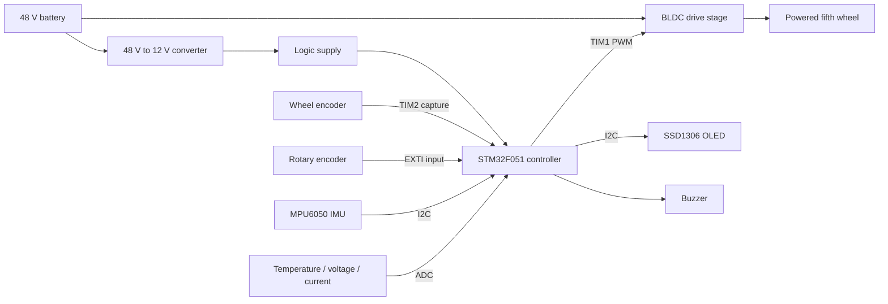

<h1 align="center">Wheelchair Assist Drive Module</h1>

<p align="center">
  <strong>STM32-based mechatronic fifth-wheel system for powered wheelchair mobility assistance.</strong>
</p>

<p align="center">
  
  
  
  
  
</p>

## Overview

This repository documents a complete embedded mechatronic prototype that adds a powered fifth wheel to a manual wheelchair. The system combines mechanical design, power conversion, brushless-motor actuation, encoder-based speed estimation, inertial sensing, analog power monitoring and an onboard OLED interface around an STM32F051 controller.

Although it originated as an academic project, it is presented here as an integrated engineering system rather than a collection of isolated exercises. The technical scope spans requirements, electronics, firmware, control logic, sensing, operator feedback and physical prototyping.

## Engineering highlights

- direct STM32 register configuration combined with STM32 HAL services;
- high-frequency TIM1 PWM generation for the motor-control interface;
- TIM2 input capture and interrupt-driven pulse counting;
- RPM estimation with a moving-average filter;
- rotary-encoder manual setpoint adjustment with bounded PWM output;
- automatic assist-mode transition after operator inactivity;
- experimentally fitted quadratic conversion from desired RPM to PWM;
- MPU6050 inertial sensing with Kalman-filtered inclination angles;
- ADC conversion for temperature, battery voltage and motor current;
- SSD1306 OLED telemetry, startup graphics and audible feedback;
- 48 V traction supply with staged conversion for control electronics;
- custom aluminum and acrylic mechanical integration.

## System architecture



## Control concept

The firmware supports two operating behaviors:

1. **Manual adjustment** — the rotary encoder changes a bounded PWM target. Direction changes are decoded from the encoder state sequence in the EXTI handler.
2. **Automatic assist prototype** — after two seconds without rotary-encoder input, the controller estimates current wheel RPM and calculates a new PWM target using the fitted motor-response model.

The current implementation is a prototype assist strategy, not a medical-device controller. It does not include redundant sensing, certified braking, fault-tolerant actuation or clinical safety validation.

See [`docs/CONTROL_SYSTEM.md`](docs/CONTROL_SYSTEM.md) for equations, timing and limitations.

## Hardware and software stack

| Layer | Implementation |
|---|---|
| Main controller | STM32F051R8Tx, 8 MHz system clock |
| Motor interface | TIM1 channel 2 PWM, bounded compare value |
| Speed feedback | Wheel pulses through TIM2 input capture |
| Operator input | Quadrature rotary encoder through EXTI |
| Inertial sensing | MPU6050 over I2C, Kalman angle estimates |
| Analog telemetry | LM35 temperature, battery divider, ACS712 current sensing |
| Local display | SSD1306 128×64 OLED over I2C |
| Mechanical structure | Aluminum plates, spacers and acrylic covers |
| Development environment | STM32CubeIDE and STM32Cube FW_F0 |

## Visual documentation

<table>
  <tr>
    <td width="50%">
      
      <br /><sub>System-level electronics and control block diagram.</sub>
    </td>
    <td width="50%">
      
      <br /><sub>Mechanical integration of the powered fifth-wheel module.</sub>
    </td>
  </tr>
</table>

Additional diagrams and prototype evidence remain embedded in the repository history and linked documentation.

## Firmware organization

```text
.
├── Core/
│   ├── Inc/                     # Application and peripheral headers
│   ├── Src/
│   │   ├── main.c               # Control loop, timers, modes and telemetry
│   │   ├── adc.c                # Analog acquisition and engineering units
│   │   ├── mpu6050.c            # IMU acquisition and Kalman filtering
│   │   ├── display.c            # Runtime OLED presentation
│   │   ├── ssd1306.c            # OLED driver
│   │   └── utilities.c          # Buzzer and support utilities
│   └── Startup/                 # STM32 startup code
├── Drivers/                     # CMSIS and STM32 HAL dependencies
├── docs/                        # Architecture, control, build and validation
├── tools/                       # Repository-quality checks
├── FifthWheel_4.ioc             # STM32CubeMX source configuration
└── STM32F051R8TX_FLASH.ld       # Linker script
```

## Build and flash

Required baseline:

- STM32CubeIDE 1.13 or compatible;
- STM32Cube FW_F0 V1.11.x;
- ST-LINK-compatible programmer;
- STM32F051R8Tx target.

```text
File → Import → Existing Projects into Workspace
Select the repository root
Build the Debug configuration
Run or Debug through ST-LINK
```

Detailed instructions are available in [`docs/BUILD.md`](docs/BUILD.md).

## Repository quality checks

The repository includes a dependency-free structural validation gate:

```bash
python3 tools/repository_health.py
```

It validates the CubeMX manifest, expected firmware modules, documentation and absence of generated build outputs. GitHub Actions runs the same check on pushes and pull requests.

This static check does not replace compilation in STM32CubeIDE or testing on the physical module.

## Documentation

- [`docs/ARCHITECTURE.md`](docs/ARCHITECTURE.md) — hardware and firmware boundaries
- [`docs/CONTROL_SYSTEM.md`](docs/CONTROL_SYSTEM.md) — control logic and signal processing
- [`docs/BUILD.md`](docs/BUILD.md) — toolchain, import, build and flashing
- [`docs/VALIDATION.md`](docs/VALIDATION.md) — evidence, test matrix and limitations
- [`docs/PROJECT_STATUS.md`](docs/PROJECT_STATUS.md) — maturity and recommended future work
- [`CONTRIBUTING.md`](CONTRIBUTING.md) — change and validation expectations

## Prototype demonstration

A historical prototype video is available through the original project link:

https://drive.google.com/file/d/1q5f74_9eyorfq265GyVNEVVHl1ltfvB8/view?usp=sharing

## Project status

**Functional historical prototype maintained as a mechatronics portfolio reference.**

The repository preserves the original firmware and engineering evidence while adding modern documentation and repository-quality infrastructure. It should not be interpreted as a certified mobility or medical device.
